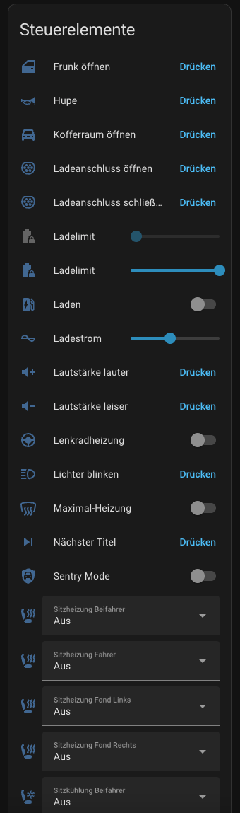
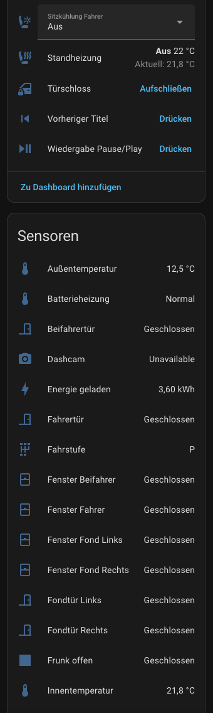
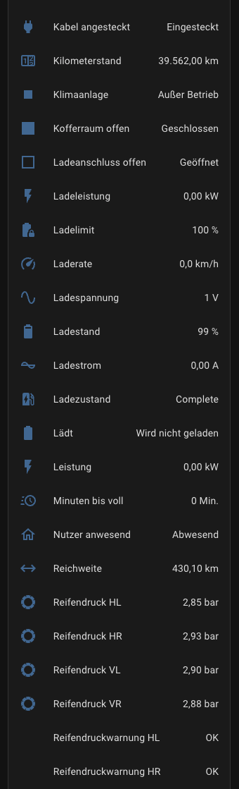
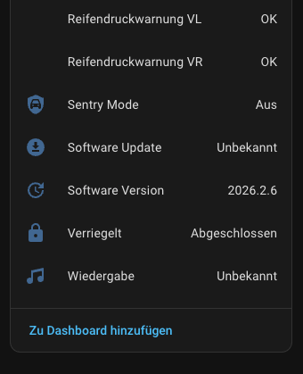
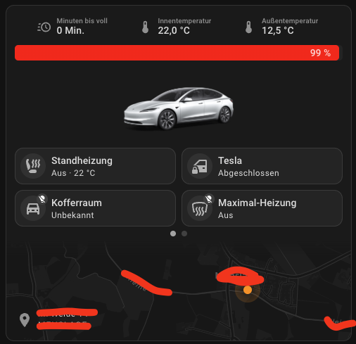

<p align="center">
  
  
  
</p>

<p align="center">
  
</p>

<h1 align="center">Tesla fuer Home Assistant</h1>

<p align="center">
  Kostenlose HACS-Integration fuer Tesla-Fahrzeuge ueber die inoffizielle Tesla Owner API.
  Kein Fleet API Abo, kein Developer-Account.
</p>

<p align="center">
  <a href="https://github.com/hacs/integration">
    
  </a>
  <a href="https://github.com/Feberdin/tesla-ha/actions/workflows/hacs.yml">
    
  </a>
  <a href="https://github.com/Feberdin/tesla-ha/actions/workflows/hassfest.yml">
    
  </a>
  <a href="https://github.com/Feberdin/tesla-ha/releases">
    
  </a>
  <a href="LICENSE">
    
  </a>
  
</p>

---

## Overview

`tesla-ha` ist eine Home Assistant Custom Integration fuer Tesla-Fahrzeuge. Die Integration bindet die inoffizielle Tesla Owner API ueber `teslapy` an, richtet sich ueber einen eingebauten Config Flow ein und stellt Fahrzeugdaten sowie Steuerfunktionen direkt als Home Assistant Entitaeten bereit.

Der Fokus des Projekts liegt auf einer kostenlosen, nachvollziehbaren und alltagstauglichen Tesla-Anbindung fuer Home Assistant. Sensorik und Bedienung sollen ohne Fleet API Abo, ohne Developer-Account und ohne zusaetzliche externe Dienste nutzbar sein.

---

## Features

- OAuth2 PKCE Config Flow direkt in Home Assistant
- 23 Sensoren fuer Ladezustand, Temperaturen, Reifendruck, Medienstatus und Fahrzeugdaten
- 22 Binaersensoren fuer Tueren, Fenster, Laden, Klima, Sentry Mode und Reifendruckwarnungen
- Steuerung fuer Klima, Laden, Verriegelung, Sitzheizung, Sitzkuehlung, Medien und Komfortfunktionen
- Wake-up-Logik fuer schlafende Fahrzeuge vor Datenabruf und Befehlen
- Deutsche und englische UI-Texte fuer den Einrichtungsdialog
- HACS-kompatible Repository-Struktur inklusive Brand-Assets und Validierungs-Workflows

---

## Screenshots

<p align="center">
  
  
  
  
</p>

Die Bilder zeigen Home Assistant Karten mit Entitaeten dieser Integration.

<p align="center">
  
</p>

> Hinweis: Die Vehicle Status-Karte im Screenshot oben stammt aus einer externen Integration und dient hier nur zur Darstellung im Dashboard.
> Vielen Dank an die Entwickler:innen dieser Karte.

> TODO: Das Repository enthaelt aktuell kein eigenes breites Banner oder ein dediziertes README-Logo fuer dieses Projekt. Falls spaeter eigenes Branding hinzukommt, sollte es getrennt von den HACS-Brand-Assets unter `assets/branding/` abgelegt werden.

---

## Installation

### Voraussetzungen

- Home Assistant `2023.1.0` oder neuer
- [HACS](https://hacs.xyz) installiert
- Tesla-Account

### HACS Installation

1. Oeffne in Home Assistant `HACS`.
2. Oeffne das Drei-Punkte-Menue oben rechts.
3. Waehle `Custom repositories`.
4. Trage `https://github.com/Feberdin/tesla-ha` als Repository ein.
5. Waehle als Kategorie `Integration`.
6. Lade die Integration herunter und starte Home Assistant neu.

### Einrichtung in Home Assistant

1. Oeffne `Einstellungen -> Geraete & Dienste`.
2. Waehle `+ Integration hinzufuegen` und suche nach `Tesla`.
3. Gib deine Tesla E-Mail-Adresse ein.
4. Oeffne den angezeigten Login-Link in einem neuen Browser-Tab.
5. Melde dich mit deinem Tesla-Account an.
6. Nach dem Redirect kopierst du die komplette Callback-URL aus der Adresszeile.
7. Fuege die URL in Home Assistant ein und schliesse den Flow ab.

Nach erfolgreicher Einrichtung erscheint das Fahrzeug unter `Einstellungen -> Geraete & Dienste -> Tesla`.

---

## Entitaeten

| Typ | Anzahl | Hinweise |
| --- | --- | --- |
| Sensor | 23 | Batterie, Laden, Klima, Reifendruck, Medien, Software |
| Binary Sensor | 22 | Tueren, Fenster, Laden, Klima, Sentry, TPMS-Warnungen |
| Climate | 1 | Standheizung / Klimaanlage |
| Lock | 1 | Tuerschloss |
| Switch | 4 | Laden, Sentry Mode, Lenkradheizung, Maximal-Heizung |
| Button | 11 | Hupe, Frunk, Kofferraum, Ladeport, Medien |
| Number | 2 | Ladelimit, Ladestrom |
| Select | 4-6 | Sitzheizung immer, Sitzkuehlung nur falls unterstuetzt |

### Was die Integration steuern kann

- Klima: Standheizung oder Klimaanlage ein- und ausschalten sowie Zieltemperatur setzen
- Fahrzeugzugriff: verriegeln und entriegeln
- Laden: Start, Stop, Ladelimit und Ladestrom zwischen `5 A` und `10 A`
- Komfort: Lenkradheizung und Maximal-Heizung
- Sicherheit: Sentry Mode
- Sitze: Sitzheizung vorne und hinten, Sitzkuehlung vorne falls vom Fahrzeug gemeldet
- Fahrzeugaktionen: Lichter blinken, Hupe, Frunk oeffnen, Kofferraum oeffnen
- Ladeport: Ladeanschluss oeffnen und schliessen
- Medien: Wiedergabe, naechster oder vorheriger Titel, Lautstaerke hoch oder runter

<details>
<summary><strong>Sensoren (23)</strong></summary>

| Sensor | Beschreibung | Einheit |
| --- | --- | --- |
| Ladestand | Aktueller Akkustand | `%` |
| Reichweite | Geschaetzte Reichweite | `km` |
| Ladelimit | Eingestelltes Ladelimit | `%` |
| Ladezustand | `Charging`, `Complete`, `Disconnected` | - |
| Ladeleistung | Aktuelle Ladeleistung | `kW` |
| Ladespannung | Spannung am Ladepunkt | `V` |
| Ladestrom | Strom am Ladepunkt | `A` |
| Energie geladen | Geladene Energie seit Anschluss | `kWh` |
| Minuten bis voll | Restzeit bis zum Ladelimit | `min` |
| Laderate | Reichweite pro Stunde Nachladung | `km/h` |
| Kilometerstand | Gesamtkilometer | `km` |
| Fahrstufe | `P`, `D`, `R`, `N` | - |
| Leistung | Verbrauch oder Rekuperation | `kW` |
| Software Version | Installierte Fahrzeugversion | - |
| Software Update | Verfuegbare Update-Version | - |
| Dashcam | Dashcam-Status | - |
| Innentemperatur | Temperatur im Innenraum | `degC` |
| Aussentemperatur | Temperatur ausserhalb des Fahrzeugs | `degC` |
| Reifendruck VL | Vorne links | `bar` |
| Reifendruck VR | Vorne rechts | `bar` |
| Reifendruck HL | Hinten links | `bar` |
| Reifendruck HR | Hinten rechts | `bar` |
| Wiedergabe | Aktuell gespielter Kuenstler und Titel | - |

</details>

<details>
<summary><strong>Binaersensoren (22)</strong></summary>

| Sensor | Beschreibung |
| --- | --- |
| Laedt | Fahrzeug laedt gerade |
| Kabel angesteckt | Ladekabel ist verbunden |
| Ladeanschluss offen | Ladeklappe ist geoeffnet |
| Batterieheizung | Batterieheizung ist aktiv |
| Verriegelt | Fahrzeug ist verriegelt |
| Nutzer anwesend | Jemand sitzt im Fahrzeug |
| Fahrertuer | Fahrertuer offen |
| Beifahrertuer | Beifahrertuer offen |
| Fondtuer Links | Hintere Fahrertuer offen |
| Fondtuer Rechts | Hintere Beifahrertuer offen |
| Frunk offen | Vordere Haube offen |
| Kofferraum offen | Hintere Klappe offen |
| Fenster Fahrer | Fahrerfenster offen |
| Fenster Beifahrer | Beifahrerfenster offen |
| Fenster Fond Links | Hinteres Fahrerfenster offen |
| Fenster Fond Rechts | Hinteres Beifahrerfenster offen |
| Klimaanlage | Klimaanlage aktiv |
| Sentry Mode | Sentry Mode aktiv |
| Reifendruckwarnung VL | Problem vorne links |
| Reifendruckwarnung VR | Problem vorne rechts |
| Reifendruckwarnung HL | Problem hinten links |
| Reifendruckwarnung HR | Problem hinten rechts |

</details>

<details>
<summary><strong>Steuerbare Entitaeten</strong></summary>

| Entitaet | Typ | Beschreibung |
| --- | --- | --- |
| Standheizung | Climate | Ein oder Aus und Zieltemperatur `15-28 degC` |
| Tuerschloss | Lock | Verriegeln und entriegeln |
| Sentry Mode | Switch | Sentry Mode ein oder ausschalten |
| Laden | Switch | Laden starten oder stoppen |
| Lenkradheizung | Switch | Lenkradheizung ein oder ausschalten |
| Maximal-Heizung | Switch | Alle Heizungen auf Maximum |
| Ladelimit | Number | Ladelimit `50-100 %` |
| Ladestrom | Number | Ladestrom `5-10 A` |
| Sitzheizung Fahrer | Select | `Aus`, `Stufe 1`, `Stufe 2`, `Stufe 3` |
| Sitzheizung Beifahrer | Select | `Aus`, `Stufe 1`, `Stufe 2`, `Stufe 3` |
| Sitzheizung Fond Links | Select | `Aus`, `Stufe 1`, `Stufe 2`, `Stufe 3` |
| Sitzheizung Fond Rechts | Select | `Aus`, `Stufe 1`, `Stufe 2`, `Stufe 3` |
| Sitzkuehlung Fahrer | Select | `Aus`, `Stufe 1`, `Stufe 2`, `Stufe 3` falls verfuegbar |
| Sitzkuehlung Beifahrer | Select | `Aus`, `Stufe 1`, `Stufe 2`, `Stufe 3` falls verfuegbar |
| Lichter blinken | Button | Fahrzeuglichter kurz aufblinken lassen |
| Hupe | Button | Hupe betaetigen |
| Frunk oeffnen | Button | Vordere Haube oeffnen |
| Kofferraum oeffnen | Button | Hintere Klappe oeffnen |
| Ladeanschluss oeffnen | Button | Ladeklappe oeffnen |
| Ladeanschluss schliessen | Button | Ladeklappe schliessen |
| Wiedergabe Pause/Play | Button | Musik pausieren oder fortsetzen |
| Naechster Titel | Button | Naechsten Titel ueberspringen |
| Vorheriger Titel | Button | Vorherigen Titel wiederholen |
| Lautstaerke lauter | Button | Lautstaerke erhoehen |
| Lautstaerke leiser | Button | Lautstaerke verringern |

</details>

---

## Konfiguration

### Update-Intervall

Das Datenupdate laeuft standardmaessig alle `5 Minuten`.
Der Wert ist in [const.py](custom_components/tesla_ha/const.py) als `UPDATE_INTERVAL` hinterlegt.

```python
UPDATE_INTERVAL = 5  # minutes
```

> Hinweis: Haeufige Abfragen koennen den 12V-Akku belasten. Bei kuerzeren Intervallen sollte das Fahrzeug nachts moeglichst nicht dauerhaft gepollt werden.

### Authentifizierung

Die Integration verwendet einen eingebauten OAuth2 PKCE Flow in [config_flow.py](custom_components/tesla_ha/config_flow.py).
Das Token wird nach erfolgreichem Abschluss in Home Assistant gespeichert.

### Lokale Entwicklung

Fuer lokale Entwicklung kann eine `cache.json` mit Tesla-Tokens existieren.
Diese Datei darf nicht committed oder veroeffentlicht werden.

---

## Automationsbeispiele

### Standheizung automatisch einschalten

```yaml
automation:
  alias: "Tesla vorheizen"
  trigger:
    - platform: time
      at: "07:30:00"
  action:
    - service: climate.set_hvac_mode
      target:
        entity_id: climate.tesla_model_3_standheizung
      data:
        hvac_mode: heat_cool
    - service: climate.set_temperature
      target:
        entity_id: climate.tesla_model_3_standheizung
      data:
        temperature: 22
```

### Benachrichtigung bei niedrigem Reifendruck

```yaml
automation:
  alias: "Tesla Reifendruck Warnung"
  trigger:
    - platform: state
      entity_id:
        - binary_sensor.tesla_model_3_reifendruckwarnung_vl
        - binary_sensor.tesla_model_3_reifendruckwarnung_vr
        - binary_sensor.tesla_model_3_reifendruckwarnung_hl
        - binary_sensor.tesla_model_3_reifendruckwarnung_hr
      to: "on"
  action:
    - service: notify.mobile_app
      data:
        title: "Tesla Reifendruck"
        message: "Reifendruck pruefen: {{ trigger.to_state.name }}"
```

### Laden stoppen wenn Ladestand erreicht

```yaml
automation:
  alias: "Tesla Laden bei 80% stoppen"
  trigger:
    - platform: numeric_state
      entity_id: sensor.tesla_model_3_ladestand
      above: 80
  condition:
    - condition: state
      entity_id: binary_sensor.tesla_model_3_ladt
      state: "on"
  action:
    - service: switch.turn_off
      target:
        entity_id: switch.tesla_model_3_laden
```

---

## Architektur

Die Integration ist bewusst kompakt aufgebaut:

- [config_flow.py](custom_components/tesla_ha/config_flow.py) implementiert den Login ueber OAuth2 PKCE
- [coordinator.py](custom_components/tesla_ha/coordinator.py) kapselt Abrufe, Wake-up-Logik und Tesla-Befehle ueber `teslapy`
- Die Plattformdateien unter `custom_components/tesla_ha/` definieren die Home Assistant Entitaeten fuer Sensoren und Steuerung

Der Coordinator arbeitet mit `DataUpdateCoordinator` und fuehrt synchrone Tesla-API-Aufrufe ueber `hass.async_add_executor_job` aus.

---

## Einschraenkungen und Fehlerbehebung

### Bekannte Einschraenkungen

- Aktuell wird nur das erste gefundene Fahrzeug verwendet (`vehicles[0]`)
- Neuere Fahrzeuge koennen Befehle wegen Teslas Command-Signing-Protokoll ablehnen
- Das Aufwecken eines schlafenden Fahrzeugs kann bis zu rund zwei Minuten dauern

### Haeufige Probleme

- Integration erscheint nicht in HACS:
  Stelle sicher, dass `https://github.com/Feberdin/tesla-ha` als Custom Repository eingetragen ist.
- Callback-URL wird nicht akzeptiert:
  Der Login-Link ist nur einmal gueltig. Starte den Config Flow erneut, um einen neuen Link zu erhalten.
- Befehle funktionieren nicht, Sensoren aber schon:
  Das spricht oft fuer Command-Signing-Einschraenkungen bei neueren Fahrzeugen.
- Fahrzeug wacht nicht auf:
  Pruefe Mobilfunk- oder WLAN-Empfang des Fahrzeugs und gib dem Wake-up etwas Zeit.

---

## Projektstruktur

```text
tesla-ha/
├── .github/workflows/              # HACS- und Hassfest-Validierung
├── assets/screenshots/             # README-Screenshots
├── custom_components/tesla_ha/     # Home Assistant Integration
│   ├── brand/                      # HACS/Home Assistant Brand-Assets
│   ├── translations/               # de/en Config-Flow Uebersetzungen
│   ├── config_flow.py
│   ├── coordinator.py
│   ├── sensor.py
│   ├── binary_sensor.py
│   ├── climate.py
│   ├── lock.py
│   ├── switch.py
│   ├── button.py
│   ├── number.py
│   └── select.py
├── CONTRIBUTING.md
├── LICENSE
├── README.md
└── hacs.json
```

### Vorgeschlagene Doku- und Asset-Struktur

Diese Struktur existiert noch nicht vollstaendig im Repository und ist als Ausbaupfad gedacht:

```text
docs/                              # TODO
├── installation.md
├── configuration.md
├── automations.md
└── troubleshooting.md

assets/branding/                   # TODO
└── readme-banner.png
```

> TODO: Sobald die README weiter waechst, sollten Installationsanleitung, Automationsbeispiele und Troubleshooting in `docs/` ausgelagert werden.

---

## Contributing

Beitraege sind willkommen. Die projektspezifischen Hinweise stehen in [CONTRIBUTING.md](CONTRIBUTING.md).

Wichtig fuer dieses Repository:

- Keine Secrets, Tokens oder lokale `cache.json` Dateien committen
- Dokumentationsaenderungen immer gegen die echte Implementierung pruefen
- Externe Dashboard-Karten oder Drittanbieter-Assets in Screenshots klar kennzeichnen

---

## Security

Bitte keine sensiblen Sicherheitsdetails in oeffentlichen Issues posten.
Siehe [SECURITY.md](.github/SECURITY.md) fuer den bevorzugten Meldeweg.

---

## License

Dieses Projekt steht unter der MIT License. Details stehen in [LICENSE](LICENSE).

---

## Support

- Issues: [github.com/Feberdin/tesla-ha/issues](https://github.com/Feberdin/tesla-ha/issues)
- Releases: [github.com/Feberdin/tesla-ha/releases](https://github.com/Feberdin/tesla-ha/releases)
- Maintainer: [Feberdin](https://github.com/Feberdin)

Wenn du einen Bug meldest, sind Home Assistant Version, Integrationsversion, relevante Logs und reproduzierbare Schritte am hilfreichsten.
